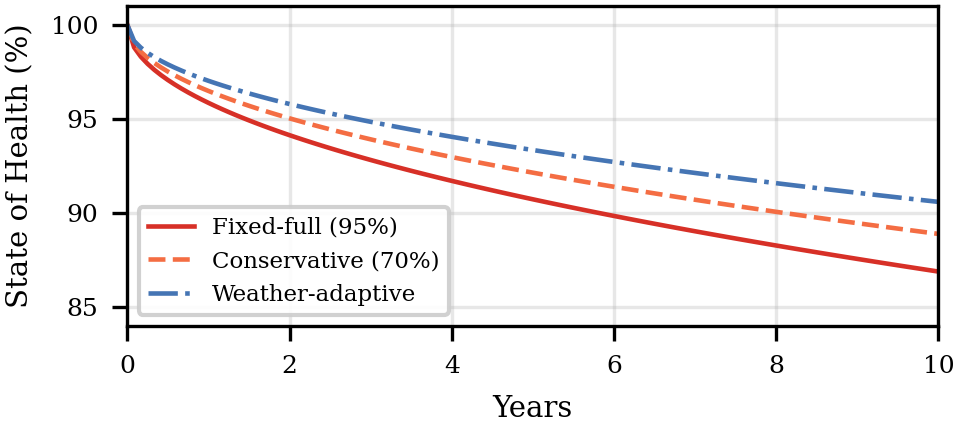

# Cross-Vessel Transfer Learning for Electric-Ship Energy Prediction & Battery Lifecycle Assessment

The experimentation code for the paper [**"Cross-Vessel Transfer Learning with Physics-Informed Constraints for Electric-Ship Energy Demand Prediction and Battery Degradation Analysis"**][paper].

## Overview

A small electric cruise ferry (**Triton**) has only ~3 months of data — too
little to train alone. We **pre-train** a physics-constrained model on a large
cruise ship (**Poseidon**, 70,000 GT, 12 months), **transfer** it to Triton with
**physics-based augmentation**, then run an **SOC simulation** and a **10-year
Arrhenius degradation** study across 48 scenarios. Physics enters as **algebraic
loss constraints** (a regularizer), not PDEs — *physics-constrained ML*, not a
classical PINN.

- **Input** (per 5-min step, 28 features): 26 weather variables (wind, wave &
  swell, air temp, pressure, humidity, radiation, ocean current), ship speed, and
  a derived operating state (stationary / maneuvering / cruising).
- **Output**: battery power demand `P_battery_kW`, propagated into SOC / SOH curves.

> _Data source: **FuelCast Benchmark** ([arXiv:2510.08217][fuelcast-paper] · [`krohnedigital/FuelCast`][fuelcast-hf]); not included in this repo._

## Repository Structure

```
.
├── src/
│   ├── data_preprocessing.py        # features → split → scale → sequence
│   ├── data_augmentation.py         # physics-based augmentation
│   ├── physics_loss.py              # PI loss terms
│   ├── phase1_energy_conversion.py  # diesel → battery power
│   ├── phase4_soc_simulation.py     # SOC + charging strategies
│   ├── phase5_battery_degradation.py# Arrhenius SOH aging
│   ├── phase6_shap_analysis.py      # SHAP importance
│   ├── phase7_efficiency_profiling.py # efficiency map
│   ├── evaluate_phase2.py           # metrics + charts
│   ├── models/                      # xgboost_baseline, pi_lstm, pi_transformer
│   ├── run_phase1.py                # Phase 1
│   ├── run_phase2.py                # Phase 2 (pre-train)
│   ├── run_phase3.py                # Phase 3 (fine-tune + ablation)
│   ├── run_phase456.py              # Phases 4–6
│   └── run_final_pipeline.py        # final report
├── tests/                           # unit tests
├── fig/                             # paper Fig. 2 (fig2_soh.png)
├── Dataset/                         # (not tracked) FuelCast .parquet
├── reports/                         # (not tracked) runtime output
└── requirements.txt
```

## Requirements

- **Python 3.10+** with PyTorch (install the CUDA build for GPU training)
- Core libraries: `torch`, `xgboost`, `scikit-learn`, `pandas`, `numpy`, `shap`,
  `matplotlib`, `seaborn`, `datasets`, `huggingface_hub`

```bash
python -m venv .venv
.venv/Scripts/activate        
pip install -r requirements.txt
```

## Usage

Place `CPS_Triton.parquet` and `CPS_Poseidon.parquet` in `Dataset/`, then run the
stages in order **from the repo root**:

```bash
python src/run_phase1.py     # 1. diesel → battery energy (Ground Truth)
python src/run_phase2.py     # 2. Poseidon pre-training (XGBoost, PI-LSTM, PI-Transformer)
python src/run_phase3.py     # 3. Triton fine-tuning — 6-way ablation (main contribution)
python src/run_phase456.py   # 4. SOC sim + 10-year degradation + SHAP (48 scenarios)
python src/phase7_efficiency_profiling.py   # 5. efficiency profiling
python src/run_final_pipeline.py            #    aggregate → reports/final_results.html
```

## Models

| Model              | Inputs         | Notes                                                                 |
| ------------------ |:--------------:| --------------------------------------------------------------------- |
| **XGBoost**        | 28 features    | Gradient-boosted baseline; no physics loss.                           |
| **PI-LSTM**        | 24×28 sequence | LSTM (hidden 256, 3 layers) trained with the physics-informed loss.   |
| **PI-Transformer** | 24×28 sequence | Transformer encoder (d=128, 4 layers) with the physics-informed loss. |

## Physics-Informed Loss

A gradient-free, algebraic regularizer is added to the data term:

```
L_total = L_data + λ · (L_cube + L_wind + L_wave + L_hotel),   λ = 0.1
```

| Term      | Constraint                       | Rationale                                 |
| --------- | -------------------------------- | ----------------------------------------- |
| `L_cube`  | `P ∝ V³`                         | Propulsion power scales with speed cubed. |
| `L_wind`  | `R_wind ∝ V_wind²` (monotonic ↑) | Wind-pressure resistance.                 |
| `L_wave`  | `R_wave ∝ H_s²` (monotonic ↑)    | Wave resistance.                          |
| `L_hotel` | `P ≥ P_hotel`                    | Minimum hotel load (lower bound).         |

`P_hotel` is a **boundary condition** (not a model input/output) and is the only
physics term re-tuned per vessel; the hydrodynamic laws (`P ∝ V³`, etc.) are
vessel-agnostic and transfer as shared knowledge.

## Results

### Energy Prediction (Table 1)

All models exceed R² > 0.91 on *Poseidon* (12 months). On *Triton* (3 months),
XGBoost wins (R² = 0.767); physics constraints narrow but don't close the
neural-network gap.

| Vessel     | Model                   | R²        | RMSE (kW) | MAPE (%) |
| ---------- | ----------------------- |:---------:|:---------:|:--------:|
| *Poseidon* | XGBoost                 | 0.923     | 2682      | 13.8     |
|            | LSTM + Physics          | **0.924** | 2669      | 13.8     |
|            | Transf. + Physics       | 0.918     | 2758      | 11.9     |
| *Triton*   | XGBoost                 | **0.767** | **558**   | 25.8     |
|            | LSTM + Physics          | 0.665     | 670       | 24.2     |
|            | LSTM ᵃ                  | 0.590     | 741       | 22.6     |
|            | LSTM + Physics ᵃ        | 0.666     | 669       | 21.9     |
|            | LSTM + Physics + Aug. ᵃ | 0.677     | 658       | 22.4     |
|            | Transf. + Physics ᵃ     | 0.655     | 679       | 22.0     |

ᵃ Pre-trained on *Poseidon* and fine-tuned on *Triton*.
Transf.: Transformer; Aug.: Augmentation.

**Ablation (neural nets).** Physics loss gives the largest gain (R² **+0.076**),
far above transfer learning (**+0.001**, large domain gap) and augmentation
(**+0.011**) — on scarce data, physics beats another ship's data ~76×.

### Battery Degradation

<p align="center">
  
</p>

Only the 60,000 kWh battery sustains operation (peak 57,456 kWh). Aging is driven
by temperature > chemistry >> strategy: NMC/tropical goes 86.9 % (fixed-full) →
90.6 % (weather-adaptive) SOH over 10 years (+3.7 pp), vs LFP/cold at 97.7–98.3 %.

> [!NOTE]
> This repository contains only the experimentation code. For the full
> methodology and detailed results, please refer to the [paper].

## License

Released under the [MIT License](LICENSE).

<!-- TODO: replace # with the published paper URL once available. -->

[paper]: #
[fuelcast-paper]: https://arxiv.org/abs/2510.08217
[fuelcast-hf]: https://huggingface.co/datasets/krohnedigital/FuelCast
